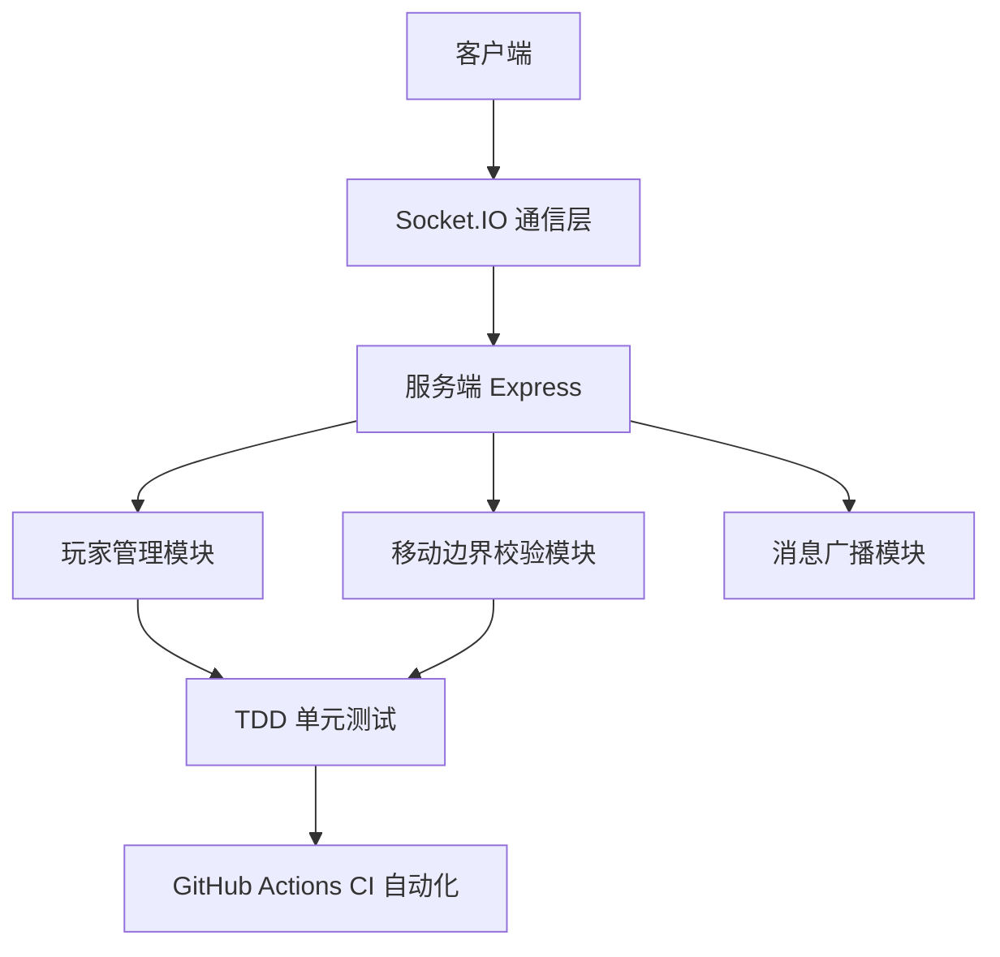

# 软件工程6组 - 官方代码仓库

## 1. 团队核心信息
### 1.1 团队名称
软件工程6组

### 1.2 团队口号
以代码筑路，以协作致远

### 1.3 项目简介
本仓库为软件工程6组核心项目协作仓库，项目为**图形化 MUD 游戏原型**，基于 Node.js + Express + Socket.IO 实现实时多人联机、玩家移动、地图边界校验、消息广播等核心能力。项目遵循 Scrum 敏捷开发流程，通过 TDD 单元测试与 GitHub Actions CI 保障代码质量与迭代稳定性。

---

## 2. Scrum 核心角色分配
| 角色                | 姓名   | 核心职责                                                                 |
|---------------------|--------|--------------------------------------------------------------------------|
| 产品负责人（PO）    | 王嘉伟 | 定义产品需求、维护 Product Backlog、确定需求优先级、对接业务方并保障产品价值 |
| 开发团队（Dev Team）| 唐浩   | 需求开发实现、代码评审、Bug 修复、按 Sprint 计划交付可用功能             |
| Scrum Master（SM）  | 宋明洋 | 保障 Scrum 流程落地、协调团队协作、移除开发障碍、管理代码仓库及协作规范   |

---

## 3. 协作规范
### 3.1 分支命名规则
- 功能分支：`feature/功能名-用户名`（例：`feature/玩家移动-唐浩`）
- 修复分支：`bugfix/问题描述-用户名`（例：`bugfix/边界校验异常-唐浩`）
- 文档分支：`docs/文档名-用户名`（例：`docs/README-王嘉伟`）

### 3.2 代码提交规范
```bash
# 提交格式：类型: 简洁描述（必填）
git commit -m "feat: 新增玩家移动逻辑"
git commit -m "fix: 修复坐标越界问题"
git commit -m "docs: 完善 README 环境搭建说明"
git commit -m "refactor: 重构服务端连接管理逻辑"
git commit -m "test: 补充边界测试用例"
```

---

## 4. 系统架构图（模块关系）


### 架构说明
- **客户端**：负责页面渲染、用户输入、连接服务端
- **通信层**：基于 Socket.IO 实现实时双向数据同步
- **服务端**：统一处理连接、玩家状态、业务规则与消息分发
- **测试与保障层**：单元测试 + CI 自动化，实现 TDD 回归保护

---

## 5. 本地开发环境搭建步骤
新成员可仅凭本文档完成完整环境搭建与项目启动：

1. **安装 Node.js**
   版本要求：v16+，官网：https://nodejs.org/

2. **克隆项目**
   ```bash
   git clone <仓库地址>
   cd team-project-official
   ```

3. **安装依赖**
   ```bash
   npm install
   ```

4. **启动服务端**
   ```bash
   npm start
   ```

5. **启动客户端**
   直接在浏览器打开项目中的 `index.html`

6. **运行单元测试**
   ```bash
   npm test
   ```

---

## 6. 核心业务模块职责说明
| 模块名称              | 职责描述                                                                 |
|-----------------------|--------------------------------------------------------------------------|
| Express 服务入口      | 启动 HTTP 服务，挂载 Socket.IO，处理客户端连接                           |
| Socket.IO 通信模块    | 维持客户端与服务端长连接，收发事件（移动、上线、消息等）|
| 玩家管理模块          | 维护在线玩家列表、玩家 ID、昵称、坐标位置、生命周期管理                   |
| 移动边界校验模块      | 判断玩家目标坐标是否合法，防止越界，保证地图规则一致性                   |
| 消息广播模块          | 将某玩家的操作/消息同步给其他所有在线玩家                               |
| 前端渲染与控制模块    | 显示游戏画面、响应用户键盘/鼠标操作、更新本地视图                       |
| TDD 单元测试模块      | 对玩家初始化、移动合法性、边界条件进行自动化测试，保障重构不破坏逻辑     |
| CI/CD 自动化模块      | 代码提交后自动安装依赖、运行测试，确保构建绿色通过                       |

---

## 7. 常用命令
```bash
npm start          # 启动生产服务
npm run dev        # 开发模式启动（热更新）
npm test           # 运行所有单元测试
npm run test:boundary # 单独运行边界测试
```

---

## 8. 注意事项
- 代码提交前务必本地运行 `npm test`，确保测试通过
- 功能开发统一从 `develop` 分支切出，完成后提交 PR 合并
- 禁止直接强制推送至 `main` 分支
- 新模块、新接口需同步更新 README 与测试用例
